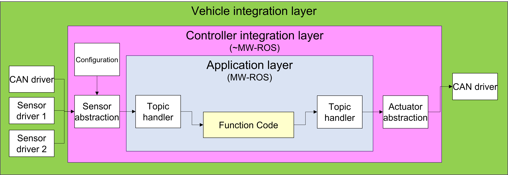
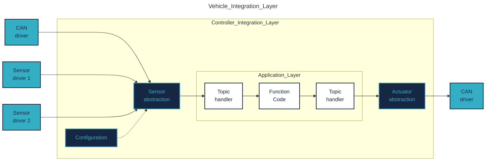

# Cooperative Research Platform

## Overview
This platform is developed and maintained by University of Győr - Vehicle Research Center in cooperation with ZalaZONE Innovation Park. The project is supported by Robert Bosch Engineering Center Budapest.\
 

 
\
**Our mission: to provide end-to-end vehicle control solutions to cover multiple driving scenarios, special focus on use-cases defined by industrial needs, utilizing cutting edge solution in terms communication, sensing, planning and control.**\
\
The platform is designed to be independent from any vehicle platform but providing a so called vehicle integration layer to adapt external signals to the controller based software components.\
We use ROS2 as middle-ware.

