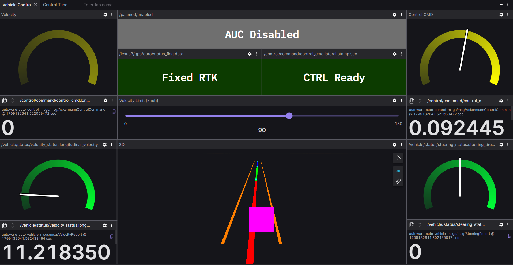
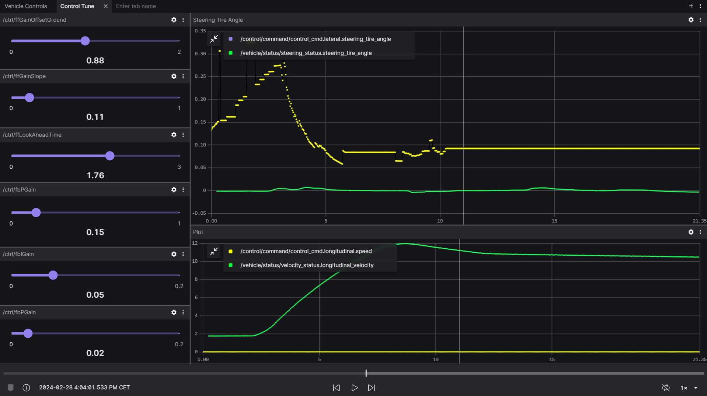

## Foxglove Dashboard

#### This Foxglove Dashboard is the main Vehicle Control interface, giving a simple overview to all the systems states in the CRP.

### PID Tune Panel 

#### This Foxglove tab is mainly used for tuning the trajectory follower node while giving plots on the lateral and longitudinal commands, vehicle state and autonomous state. 

